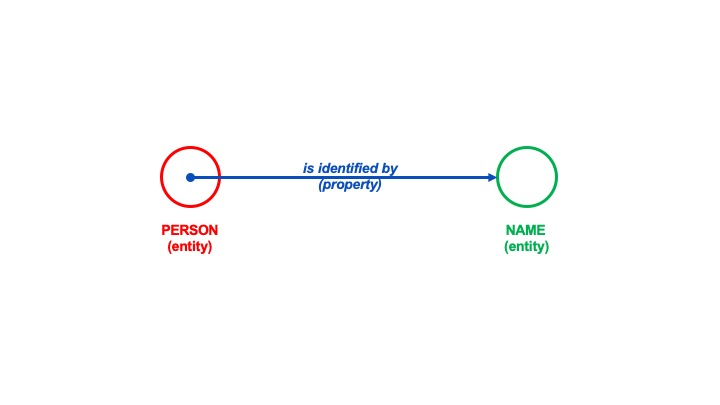

# Triples

A triple is a data configuration in which a data entity is linked by a relationship property to another data entity. 

For example, a person (entity) is identified by (property) a name (entity)

Further reading:
* [link name](link url)
