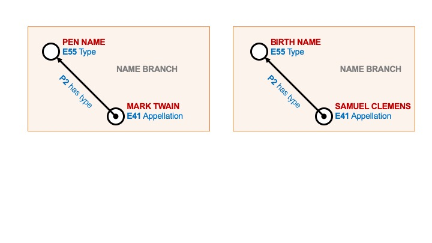

# Concept Data Type

The Concept data type connects a Node to a controlled vocabulary for data entry. In Arches, controlled vocabularies are called Concept Collections. In the Name branch example below, the node for Name Type would be assigned the Concept data type which would also necessitate the designation of a Concept Collection that contains the Concepts (or terms) for Name Type. 

The Concept Collection would include the Concepts of "Birth Name" and "Pen Name", as well as other types of names. Concepts and Concept Collections are managed by Arches in the Reference Data Manager. 

As described in the section on Controlled Vocabularies, Concepts and Concept Collections have their own organizing principles and are an extension of the data model structure. 

