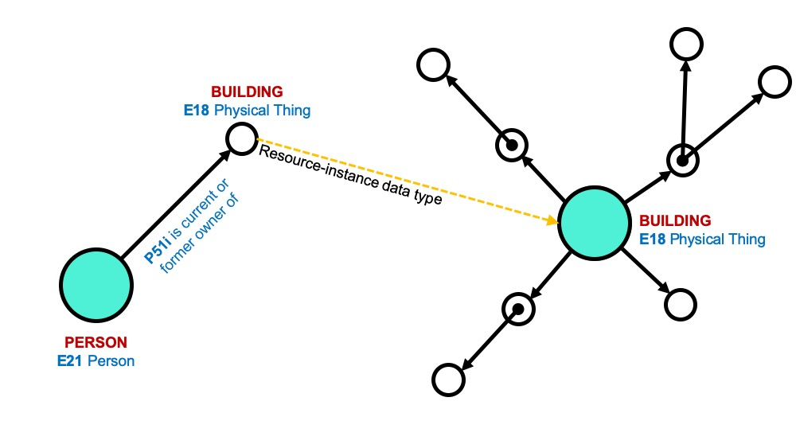

# Relationships between Resource Models

Through the resource-instance data type, relationships can be created between Resource Models. 

In the example above, the Person Resource Model has a Node for Building that the Person currently or formerly owned. This Node was assigned a resource-instance data type and links to the Resource Model for Building. This allows instances of the Building Resource Model to be associated with many different instances of the Person Resource Model and other Resource Models.

