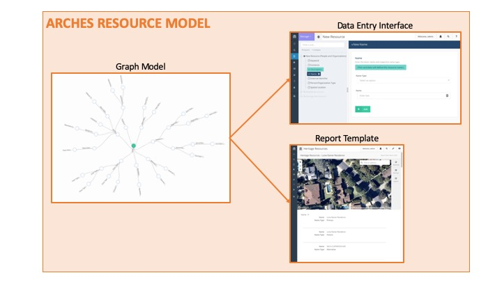

# What is an Arches Resource Model?

An Arches Resource Model is a semantic graph data model formatted for use with the Arches Platform. Arches Resource Models also include the information and formatting for the data entry interface (i.e. forms) to input the data and the report to display the data for each Resource Model.

For example, if your Arches instance records information on Buildings, People, and Activities, you would typically create a Resource Model for Building, a Resource Model for People and a Resource Model for Activities. This would result in a data entry interface and report template for Buildings, a data entry interface and report template for People, and a data entry interface and report template for Activities. 

All of this is encoded in a JSON file that can be exported from one Arches implementation and imported into another. In other words, the same Arches Resource Model or set of Arches Resource Models can be used by different Arches implementations. 

The Arches Resource Model Working Group focuses primarily on creating guidance on the semantic graph model portion of the Arches Resource Model as well as providing sample Arches Resource Models, as well as Branches, that can be used and modified by various Arches implementers. 