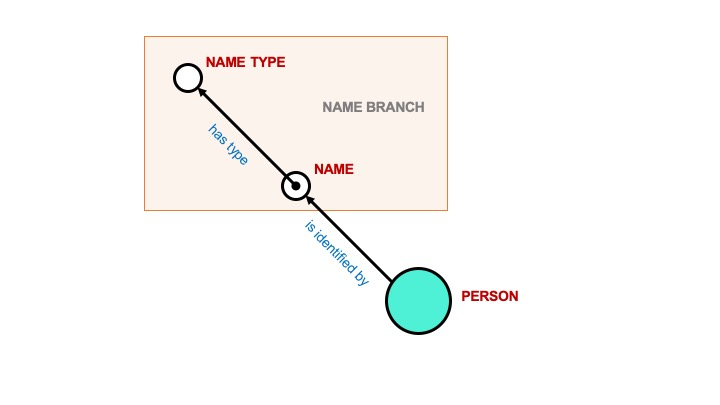
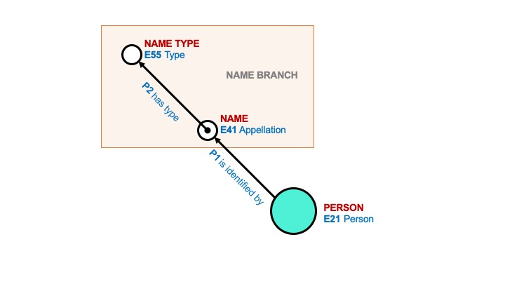
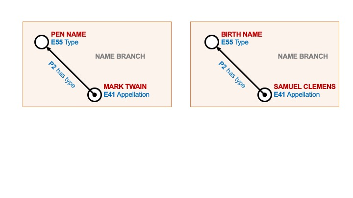

# Anatomy of an Arches Branch

An Arches Branch typically groups data together that is thematically related. In the example below, this simplified Name Branch consists of the triple formed by "Name"(entity) "has type"(property) "Name Type"(entity). 

In Arches, the entities are represented by Nodes and the properties are the Relationships. "Name" and "Name Type" are Nodes and "has type" is the Relationship between the Nodes. 

In using the CIDOC CRM ontology, each Node is assigned a CRM Class and each Relationship is assigned a CRM Property. The semantic statement formed by the branch then reads as: "Name" (as defined by CRM Class E41 Appellation) "has type" (as defined by CRM Property P2 Has Type) "Name Type" (as defined by CRM Class E55 Type).

This defines the structure for a very simplified version of a Name branch. It is possible that more types of information would need to be represented in a Name branch, such as the language of Name or the source of a Name, and additional Nodes and Relationships can be added to accommodate such needs. It is important to note that Arches can easily be configured to record as many instances (entries) of the data represented in the Name branch as needed. 

For example, below are two instances of the Name branch for the same Person.

Mark Twain, the author of "The Adventures of Tom Sawyer", was given the name "Samuel Clemens" at birth, and above is an example of how the Name branch structure shown is able to represent both names along with the type of name associated with each. 

