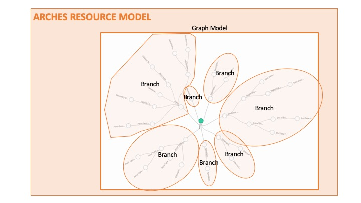

# Resource Models and Branches

(Arches) Resource Models consist of discrete Branches that function as smaller graph models within the larger whole. 

For example, a Resource Model for People might be composed of a Name branch that contains all of the data related to a person's name and a Description branch that contains all of the data relating to the description of that person. 

A Branch can be used by many different Resource Models. For example, basic Name and Description branches can be used by the respective Resource Models for People, Buildings, and Activities. And similar to Resource Models, Branch information is encoded in a JSON file that can be exported from one Arches implementation and imported into another. 